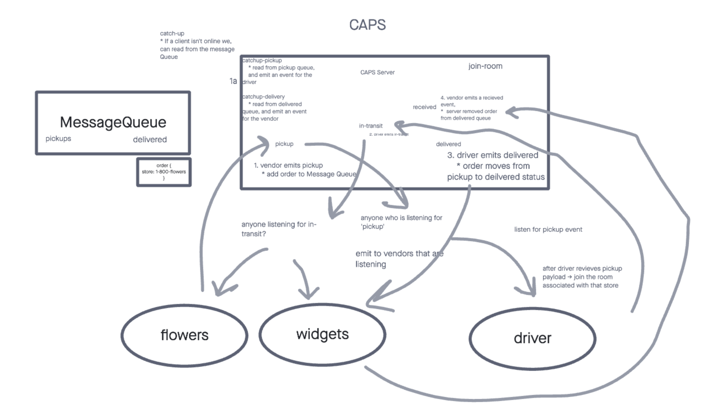

# CAPS Server

Code Fellows JS 401d52 Code Academy Parcel Service.

## Usage

1. Copy / Clone code.
2. `cd <CAPS_SERVER_FOLDER>`
3. `npm install`
4. `npm start`

### Driver

Listens for pickup events and emit `in-transit` and `delivered`.

`npm run driver`

### Flowers

Emits payloads as a flower store client.

`npm run flowers`

### Widgets

Emits payloads as a widget store client.

`npm run widgets`
