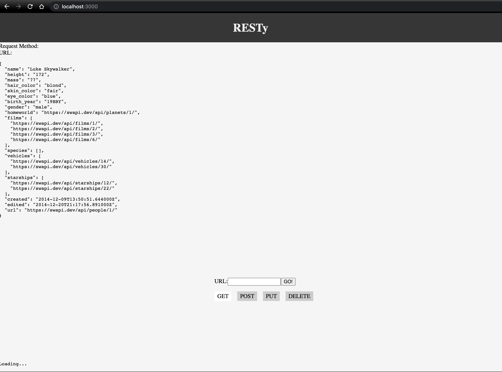
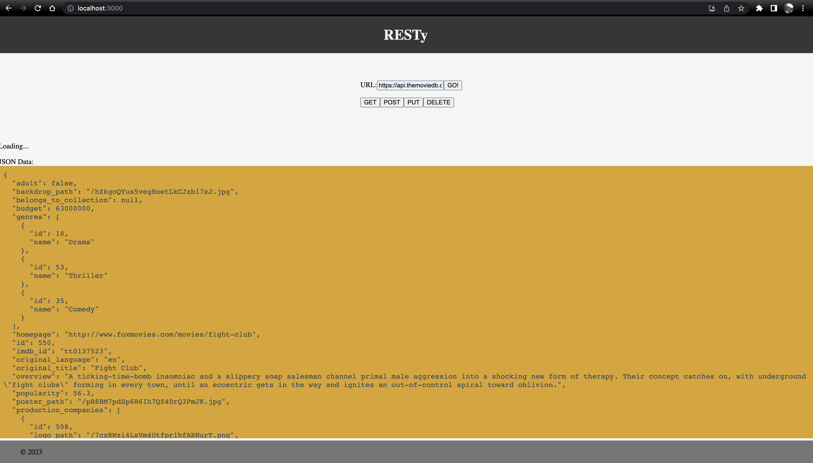

# RESTy App

This application makes it possible for developers to test their api calls live. Use RESTy to double-check if your GET, POST, PATCH, and DELETE functions work with your URLs before you push your code up for production or review. Using React, I am implementing a friendly UI for the web. Not everyone has access to Thunder Client considering there are so many IDEs that are in use that do not support the extension. 

## Phase 2 - Mock Request

## Phase 3 - Live API Request

